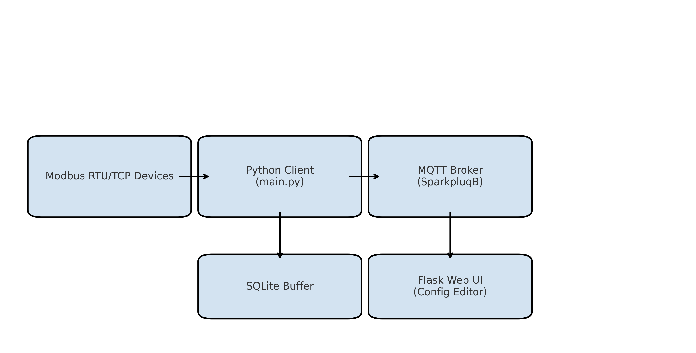
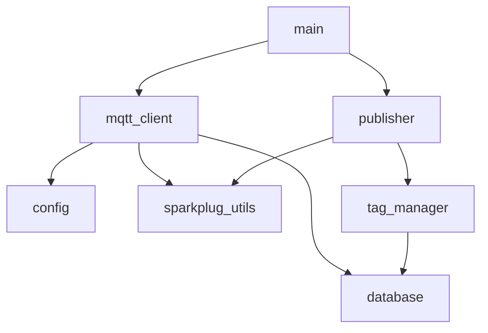

# Modbus to MQTT SparkplugB Transmitter


This project reads simulated or acquired tag data and publishes it to an MQTT broker using the **SparkplugB protocol**. It includes reconnect logic, birth/death messages, historical buffering, and tag-level deadband filtering. Configuration is stored in **SQLite**, and the system is designed for **industrial edge deployments**.

> ⚠️ **Development Status**: Active  
> Version `0.0.1` — this project is in early development and not yet considered production-ready.  
> Interfaces, config structure, and MQTT payloads may change.

---

## 📊 System Architecture



---

## 📁 Project Structure

```
- mqtt/
  - config.py              # Load broker and project settings from SQLite
  - database.py            # Buffering, flushing, and tag metadata retrieval
  - main.py                # Main script entrypoint
  - mqtt_client.py         # MQTT logic using Paho client + SparkplugB payloads
  - publisher.py           # Data simulation and tag publishing
  - sparkplug_utils.py     # Payload construction for SparkplugB
  - tag_manager.py         # Handles deadband filtering and tag value tracking
  - requirements.txt       # Python dependencies
  - structure.graphql      # (Optional) GraphQL schema or shape

  - client_libraries/
    - sparkplug_b.py       # SparkplugB helpers
    - sparkplug_b_pb2.py   # Generated protobuf for SparkplugB

  - sql/
    - config.db            # SQLite database for settings and tag topics
    - fetch_database.py    # Utility to interact with the DB

  - test_files/
    - Flow Rate, Flow Total  # Test tag directories or placeholder values

  - utils/
    - properties.py        # Helper for reading config properties
```

---

## 🔁 Module Dependencies



---

## ✅ Features

- 📡 SparkplugB-compliant (NBIRTH, DBIRTH, DDATA, NDEATH, etc.)
- 🗂️ SQLite-based configuration for tags, topics, and brokers
- 🧠 Tag-level deadband and bypass control
- 📦 Buffered MQTT publishing with historical replay
- 🔁 Automatic reconnect watchdog
- 📈 API-driven logging configuration

---

## ▶️ Getting Started

```bash
pip install -r requirements.txt
python main.py
```

Ensure `config.db` is populated with:
- MQTT broker settings
- Tag and topic mappings
- Deadband thresholds

---

## 🌐 Logging API (Complete)

| Endpoint                     | Method | Description                              |
|-----------------------------|--------|------------------------------------------|
| `/api/logs/max_size`        | POST   | Set max log file size (bytes)            |
| `/api/logs/max_files`       | POST   | Set number of log file backups           |
| `/api/logs/level`           | POST   | Set log level (e.g. DEBUG, INFO)         |
| `/api/logs/config`          | GET    | View current log configuration           |
| `/api/logs/tail?lines=50`   | GET    | Return last N lines of log file          |
| `/api/logs/files`           | GET    | List all `.log` files                    |
| `/api/logs/download/<file>` | GET    | Download specific log file               |

---

## 🛣️ Roadmap

- [x] Basic Modbus RTU/TCP reading
- [x] SparkplugB publisher with SQLite config
- [x] Logging API
- [ ] Web-based config editor
- [ ] TLS cert file upload support
- [ ] MQTT connection status UDT
- [ ] Siemens S7 and OPC-UA integration
- [ ] Docker build + auto-start service
- [ ] Shift-based flow total calculation
- [ ] **Switch to config files (TOML/YAML/JSON) instead of SQLite for Git-friendly versioning**
- [ ] Generate `docs/` folder for GitHub Pages deployment

---

## 📜 License

MIT License — see `LICENSE`.

---

## 👨‍💻 Author

**Jacob Ramirez**  
GitHub: [@jacob-ramirez-2020](https://github.com/jacob-ramirez-2020)  
SCADA & IIoT Developer | SparkplugB Integrator | Cloud & Edge Architect

---

_Designed for Industrial IoT applications using Cirrus Link SparkplugB and Ignition._
