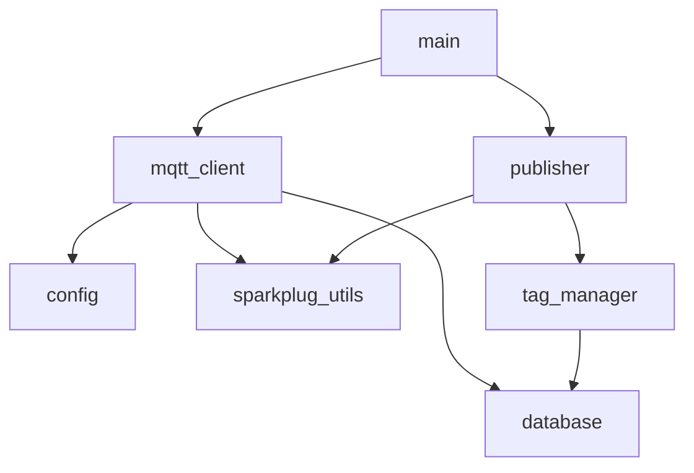

# MQTT SparkplugB Publisher

This project reads simulated or acquired tag data and publishes it to an MQTT broker using the SparkplugB protocol. It supports reconnect logic, birth/death message handling, historical buffering, and deadband filtering.

## 📁 Project Structure
```
- mqtt/
  - config.py              # Load broker and project settings from SQLite
  - database.py            # Buffering, flushing, and tag metadata retrieval
  - main.py                # Main script entrypoint
  - mqtt_client.py         # MQTT logic using Paho client + SparkplugB payloads
  - publisher.py           # Data simulation and tag publishing
  - sparkplug_utils.py     # Payload construction for SparkplugB
  - tag_manager.py         # Handles deadband filtering and tag value tracking
  - requirements.txt       # Python dependencies
  - structure.graphql      # (Optional) GraphQL schema or shape

  - client_libraries/
    - sparkplug_b.py       # SparkplugB helpers
    - sparkplug_b_pb2.py   # Generated protobuf for SparkplugB

  - sql/
    - config.db            # SQLite database for settings and tag topics
    - fetch_database.py    # Utility to interact with the DB

  - test_files/
    - Flow Rate, Flow Total  # Test tag directories or placeholder values

  - utils/
    - properties.py        # Helper for reading config properties
```

## 🔁 Module Dependencies


## ✅ Features
- SparkplugB compliant (NBIRTH, DBIRTH, DDATA, NDEATH, etc.)
- SQLite-based tag/topic configuration
- Historical buffering and replay after reconnect
- Automatic reconnect watchdog
- Deadband filtering per tag

## ▶️ Getting Started
```bash
pip install -r requirements.txt
python main.py
```

Ensure `config.db` is populated with MQTT broker settings and topic configurations.

✅ Ready for Production
The following endpoints are now complete and documented:

Endpoint	Method	Description
/api/logs/max_size	POST	Set max log file size (bytes)
/api/logs/max_files	POST	Set number of log file backups
/api/logs/level	POST	Set the logging level (e.g. DEBUG)
/api/logs/config	GET	Get current log config
/api/logs/tail?lines=50	GET	Return the last N lines of log file
/api/logs/files	GET	List all .log files
/api/logs/download/<filename>	GET	Download a specific log file


---
_Designed for industrial IoT applications using Cirrus Link SparkplugB and Ignition._